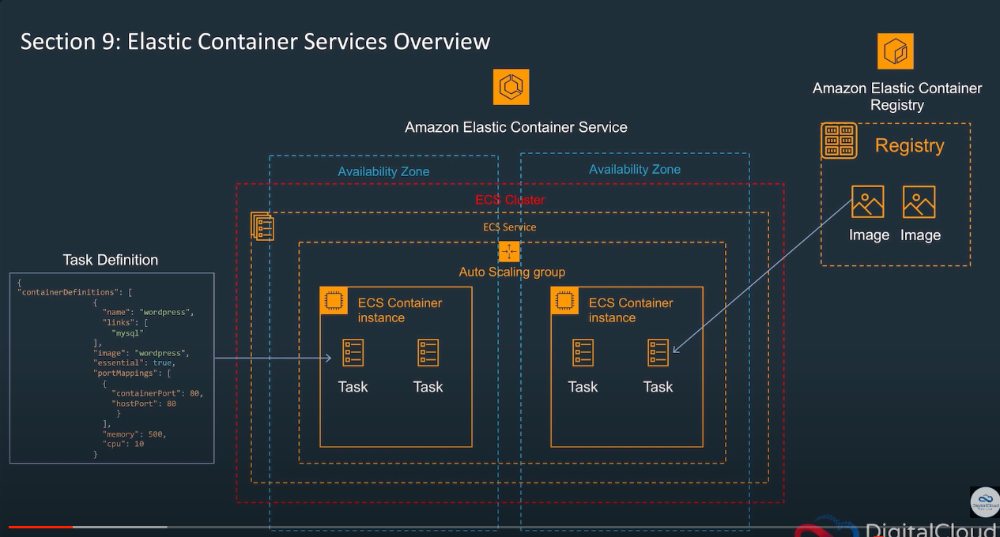

# 10월 16일 월요일

# 작업(Task)과 서비스(Service)를 생성하는 순서
```markdown
작업(Task) 정의 생성:

먼저 작업(Task)를 실행할 컨테이너를 정의한 작업 정의(Task Definition)를 생성합니다. 이 작업 정의는 컨테이너 이미지, 리소스(메모리 및 CPU), 포트 매핑 등을 정의합니다.
aws ecs register-task-definition 명령을 사용하여 작업 정의를 등록합니다.
서비스(Service) 생성:

작업 정의가 등록되었으면, 해당 작업 정의를 기반으로 서비스를 생성합니다. 서비스는 클러스터 내에서 작업을 실행하고 관리합니다.
aws ecs create-service 명령을 사용하여 서비스를 생성합니다.
작업 정의는 서비스를 생성할 때 필요한 구성 요소이므로 먼저 작업 정의를 생성하고 나서 서비스를 생성하는 것이 일반적인 순서입니다. 이렇게 하면 서비스가 작업 정의를 참조할 수 있으며 작업을 클러스터에서 실행할 준비가 됩니다.
```

# Task와 Task Definition 의 차이
```markdown
서로 다른 개념

Task Definition: Task Definition은 Amazon ECS에서 실행할 컨테이너화된 애플리케이션을 정의하는 JSON 또는 YAML 파일입니다. 이 정의에는 컨테이너 이미지, 리소스(메모리 및 CPU), 환경 변수, 네트워크 구성, 로깅 설정 등 컨테이너 실행에 필요한 모든 정보가 포함됩니다. Task Definition은 일종의 템플릿으로, 하나 이상의 컨테이너를 설명하며 클러스터 내에서 작업으로 실행됩니다.

Task: Task는 실제로 클러스터에서 실행되는 컨테이너 그룹입니다. Task Definition을 기반으로 생성되며, 클러스터에서 실행되는 컨테이너 인스턴스입니다. 예를 들어, Task Definition에서 정의한 컨테이너 이미지와 설정을 사용하여 작업이 실행됩니다. 한 Task Definition으로 여러 개의 작업(Task)을 생성할 수 있습니다.

요약하면, Task Definition은 컨테이너 설정을 정의하고, Task는 클러스터에서 실행되는 작업(실제 컨테이너 인스턴스)를 나타냅니다. Task Definition을 작성한 후 이를 기반으로 Task를 여러 개 생성하여 클러스터에서 여러 작업을 실행할 수 있습니다.
```

# task-definition 에서 taskRoleArn과 executionRoleArn

```markdown

taskRoleArn과 executionRoleArn은 Amazon ECS 작업(Task) 실행에 사용되는 두 가지 서로 다른 IAM 역할(Role)을 나타냅니다. 이 두 역할 간의 차이점은 다음과 같습니다:

taskRoleArn:

taskRoleArn은 작업(Task)이 실행되는 동안 컨테이너 내에서 AWS 서비스에 액세스하기 위한 IAM 역할(Role)을 지정합니다.
이 역할은 작업이 실행 중에 다른 AWS 서비스(예: S3 버킷에 파일 업로드) 또는 AWS 서비스 API(예: AWS Systems Manager Parameter Store에서 비밀 값 가져오기)에 액세스하는 데 사용됩니다.
작업이 실행 중에만 필요한 권한을 가지는 역할입니다.
executionRoleArn:

executionRoleArn은 Amazon ECS 에이전트가 작업을 실행할 때 사용하는 IAM 역할(Role)을 지정합니다.
Amazon ECS 에이전트는 클러스터 노드에서 작업을 시작하고 관리하는 역할을 담당합니다.
executionRoleArn은 클러스터 노드와 관련된 작업 실행 및 관리 작업에 사용되며 작업의 실행 환경을 구성하는 데 사용됩니다.
이 역할은 클러스터에서 모든 작업에 대한 역할로 사용됩니다.
요약하면, taskRoleArn은 작업(Task) 자체가 실행 중에 필요한 권한을 가지는 역할이며 executionRoleArn은 Amazon ECS 에이전트가 작업을 실행하고 관리하는 데 사용되는 역할입니다. 각 역할은 서로 다른 목적과 범위를 가지고 있으며 작업 및 클러스터 관리에 사용됩니다.

```

# ECS cluser 및 service 생성할 때 네이밍 규칙
- as-is
  - dev-inofi-api
- to-be
  - inofi-api-dev
- **이렇게 하는 이유는 sort할 때 dev가 prefix붙어버리면 문제가 생긴다**

# CIDR
- CIDR/30 인 경우, ip(32자리) 중 30개 까지 같으면 총 2의 제곱 개만 ip를 발급 받을 수 있다 (심각한 문제이다)
  - 데브옵스 엔지니어가 CIDR에 대한 잘못된 지식을 가지고 있으면 이런 문제가 발생될 수 있다
  - 2진수, 8진수, 10진수, 16진수

# load balancer 세팅
- certificate 인증 받기
  - 어떻게 인증되는 지 아는가? ( 아니오 )
- 로드밸런서에 443 리스닝 포트 추가 후 콘솔에서 인증서 추가
- 기존 80포트 리스닝에는 443으로 리다이렉트 시키도록 수정
  - 왜 443으로 리다이렉트 해야하는 지 아는가? ( 아니오 )

---