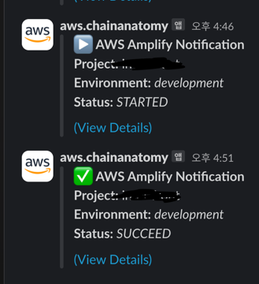

# Amplify Deployment Notifications to Slack

## Prerequisites
- AWS Account
- Slack workspace and webhook URL
- ... (any other prerequisites)

---

## Setup
### 1. Configuring Slack Webhook
- [slack-link](https://api.slack.com/messaging/webhooks)

### 2. Setting up the Lambda Function
- create lambda function in aws console
  - use index.js
- add environment
    - `PROJECT_NAME`
    - `SLACK_WEBHOOK_PATH`
  
### 3. Configuring the SNS Topic

### 4. Linking Amplify with SNS
- amplify must be created as `development` , `main`

---

## Testing the Notification

---
## Troubleshooting
- need to set lambda log group's `Retension` as 3days

